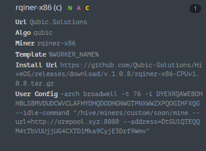

## 1. 说明

因为qubic的四十分钟的空闲机制问题，导致每挖40分钟的qubic，同样的也会空闲40分钟，在qubic的收益大于或等于ore的时候，使用调度双挖策略，在机器空闲时去挖40分钟的ore，然后等待qubic的调度。这样的调度策略可以一般情况下可以提高你百分之40的收益，当然在ore收益远远高于qubic的情况则不需要使用这种策略。


## 2. 示例


目前经过测试的仅仅适用于 [R池](https://github.com/Qubic-Solutions)。


* 命令行运行示例

```c
./rqiner-x86-broadwell -t 16 -i AWZXTNOZSWWYOFFRPICVEPDFNQEAFQLXXEEEUKMXAHVYEQZJHBRIANSDTLFD -l test -c "/home/ub/work/mine --url=http://orep
ool.xyz:8080  --address=3e4CUVZohTir3sKW7ueZuf2ec512km2BfekyxKrVai"
```


重点就是在运行的r池的锄头时加上参数 `-c "/home/ub/work/mine --url=http://orepool.xyz:8080  --address=3e4CUVZohTir3sKW7ueZuf2ec512km2BfekyxKrVai"`

其中`/home/ub/work/mine` 需要修改为你本机的ore锄头的路径。


* 飞行表运行示例



配置参数的时候增加 `--idle-command "/home/ub/work/mine --url=http://orepool.xyz:8080  --address=3e4CUVZohTir3sKW7ueZuf2ec512km2BfekyxKrVai"`即可。同样记得修改ore锄头路径与钱包地址。


